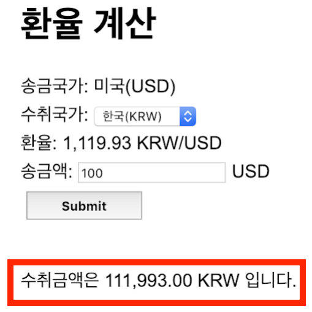

# 환율 계산기 구현하기

## 기능 목록
### 필수 기능 목록
- 환율
  - [x] 외부 API를 사용해 환율 정보를 가져온다.
  - [x] 환율 정보 조회에 실패하면 에러를 반환한다.
  - [x] 수취국가(한국, 일본, 필리핀)에 따른 환율 정보를 반환한다.
  - [x] 반환되는 환율 정보는 소수 2째자리까지 나타낸다.
- 환전
  - [x] 수취국가에 따른 환율로 환전을 진행한다.
  - [x] 송금액이 올바르지 않은 경우, "송금액이 바르지 않습니다." 메세지와 함께 에러를 던진다.
  - [x] 환전이 정상적으로 처리된 경우 수취 금액을 보여준다.
- 화면
  - [x] 수취 금액과 환율 정보는 3이상이 되면 ","로 구분하고 소수점 두자리로 표현한다.
  - [x] 잘못된 송금액을 입력한 경우 "송금액이 바르지 않습니다." 메세지를 알림으로 띄운다.

### 부가 기능 목록
- [x] 송금 정보를 기록한다.
- [x] RestTempalte 설정을 고도화한다.

## 진행 방식
- 기능 요구 사항, 프로그래밍 요구 사항, 과제 진행 요구 사항 3가지를 정의하고 모두 만족시킨다. 
- 기능을 구현하기 전에 기능 목록을 만들고, 기능 단위로 커밋하는 방식으로 진행한다.
- 기능 요구 사항에 기재되지 않은 내용은 스스로 판단하여 구현한다.

### 기능 요구 사항


- 송금 국가는 미국으로 고정되며, 통화는 미국 달러(USD)이다.
- 수취국가는 한국, 일본, 필리핀 세 군데를 select box로 선택한다. 각각 통화는 KRW, JPY, PHP이다.
- 수취국가를 선택하면 환율이 나타나며, 환율은 1USD를 기준으로 각각 KRW, JPY, PHP의 대응 금액이다.
- 송금액을 USD로 입력하고 Submit을 누르면 수취 금액이 KRW, JPY, PHP 중 하나로 계산되어야 한다.
- 환율과 수취금액은 소수점 2째자리까지, 3자리 이상이 되면 콤마를 찍어 보여준다. ex) 1234 -> 1,234.00
- 환율 정보
  - 환율 정보는 https://currencylayer.com/ 의 무료 서비스를 이용해서 실시간으로 가져온다.
  - 새로운 무료 계정 API키를 받아서 상용하면 되고, 해당 샘플 키는 다음과 같다.
    ex) http://www.apilayer.net/api/live?access_key=ee50cd7cc73c9b7a7bb3d9617cfb6b9c
  - 웹 서버가 시작될 때 한번만 가져와도 되고, 매번 새로운 환율 정보를 가져와도 된다.
  - USD/KRW이 KRW/USD 환율, USD/JPY이 JPY/USD 환율, USD/PHP가 PHP/USD 환율이며 이 환율 정보를 이용해서 환율 계산을 하면 된다.

```json
{
  "success": true, 
  "terms": "https:\/\/currencylayer.com\/terms", 
  "privacy":"https:\/\/currencylayer.com\/privacy",
  "timestamp": 1545881647,
  "source": "USD",
  "quotes": {
    "USDJPY":110.959498,
    "USDPHP":52.72027,
    "USDKRW":1121.419945
  }
}
```

- 환율은 미리 계산해서 html/javascript 안에 넣어두고 수취 국가를 변경할 때마다 자바스크립트로 가져와서 보여줘도 된다.
- 혹은 매번 수취국가를 선택/변경 할 때마다 API로 서버에 요청해서 가져와도 된다.
- Submit을 누르면 선택된 수취 국가와 환율, 송금액을 가지고 수취 금액을 계산해서 하단에 보여주면 된다.
  - API를 이용해 서버에서 계산해서 뿌려도 되고
  - 자바스크립트로 미리 가져온 환율을 계산해서 수취금액을 보여줘도 되고
  - Submit으로 폼을 submit해서 화면에 새로 그려도 된다.
  - 수취금액을 입력하지 않았거나 올바르지 않거나, 0~10,000 USD 사이의 금액이 아니라면 "송금액이 바르지 않습니다." 라는 에러 메세지를 보여준다.
    - 메세지는 팝업 혹은 빨간 글씨로 나타내면 된다.

